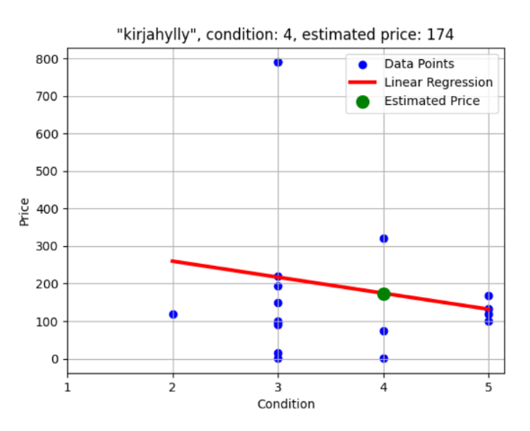
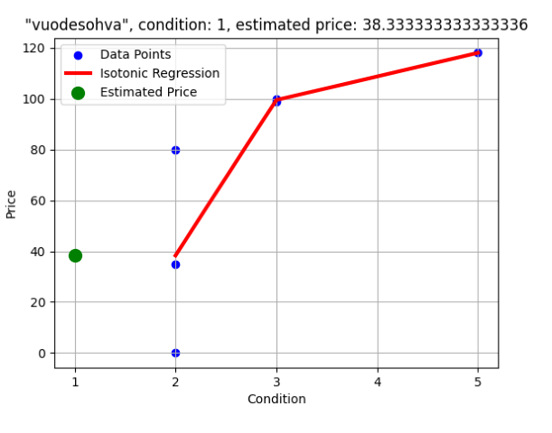
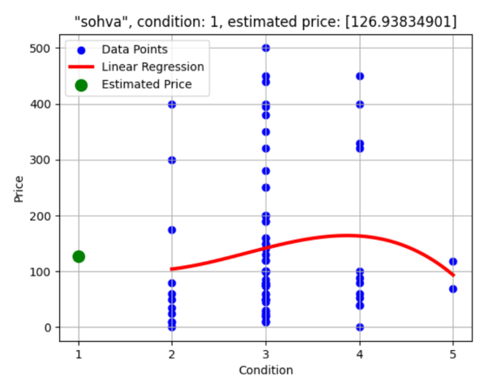
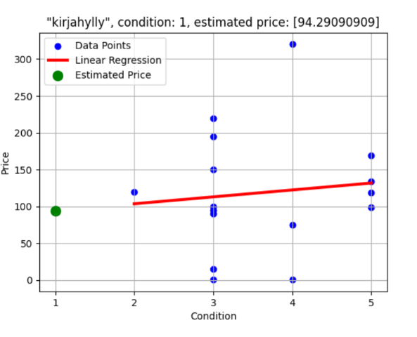
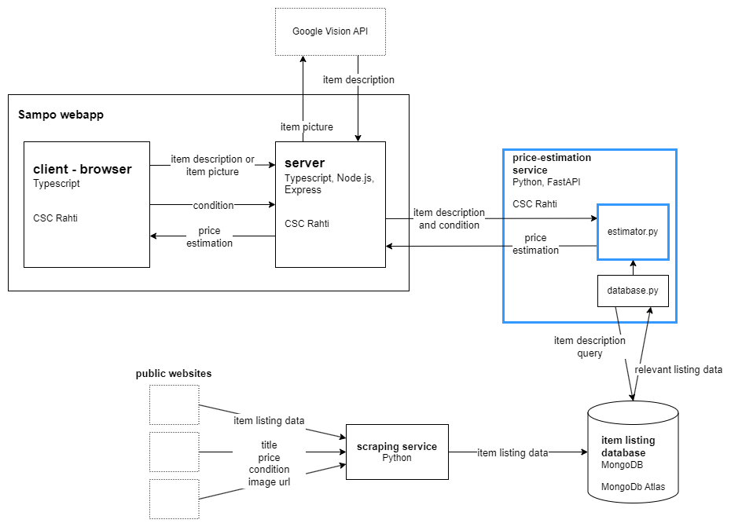

# Regressioanalyysi ja mikropalvelu Pythonilla

## Johdanto

Kehitämme Ohjelmistoprojekti 2 -kurssilla [sovellusta](https://github.com/ohjelmistoprojekti-sampo/sampo), joka arvioi käytetyn tuotteen, etenkin huonekalujen, myyntihinnan verkosta saatavien myynti-ilmoitusten tietojen perusteella. Tämä työ käsittelee tämän sovelluksen hinnanarviointipalvelun luomista, julkaisemista ja sen hinnanarviointilogiikkaa. Työn tavoitteena oli luoda palvelu, joka arvioi tuotteen hinnan kuntoluokituksen perusteella. Lisäksi tavoitteena oli oppia yksinkertaisen Python-mikropalvelun luomisesta ja julkaisusta, sekä tutustua datan käsittelyyn ja ennusteiden luomiseen Pythonin kirjastoilla.

Ensin loin yksinkertaisen REST-palvelun Pythonin FastAPI-verkkokehyksellä. Datan käsittelyyn ja ennusteiden luomiseen käytin Pythonin NumPy-, pandas- ja scikit-learn-kirjastoja. Tein ensin yksinkertaisen lineaariseen regressioanalyysiin perustuvan funktion, joka arvioi tuotteen myyntihinnan kuntoluokan perusteella. Kokeilin myös muita malleja, ja sain parannettua arvioita esikäsittelemällä dataa. Lopuksi pakkasin palvelun Docker-konttiin ja julkaisin palvelun Tieteen tietotekniikan keskuksen Rahti-pilvipalvelussa.

Opin työssä rakentamaan yksinkertaisen REST-mikropalvelun Pythonilla, ja julkaisemaan sen Dockerin avulla. Tutustuin myös työssä regressioanalyysin tekemiseen Pythonilla. Työn tuloksena on hinnanarviointipalvelu, joka on käytössä Ohjelmistoprojekti 2 -kurssin sovelluksessa. 

## REST-palvelu

Päädyin käyttämään REST-palvelun toteutukseen [FastAPI](https://fastapi.tiangolo.com/) web-kehystä, koska dokumentaationsa perusteella yksinkertaisen sovelluksen saa nopeasti ja helposti pystyyn. Asensin dokumentaation mukaisesti fastapi- sekä uvicorn-paketit pip-työkalulla. Tämän jälkeen loin `main.py` tiedoston, jossa määritellään palvelun ainoa päätepiste `/estimate-price`, ja sille kaksi pakollista pyynnön parametria, tuotteen kuvaus ja kunto.

```
from fastapi import FastAPI, Query

app = FastAPI()

@app.get("/estimate-price")
def estimate_price(
    item_description: str = Query(..., description="Description of the item"),
    condition: int = Query(..., description="Condition of the item (1-5)", ge=1, le=5)
):

    item_description = item_description
    condition = condition

    # TODO:
    # 1. Get relevant dataset matching item_description from database
    # 2. Estimate price using the dataset and condition

    # to see if the parameters are working correctly
    print(f"Item description: {item_description}, Condition: {condition}")
    # placeholder value, replace with price estimation function
    return {"price": 42}
```

Testattuani että palvelu toimii, aloitin seuraavaksi itse hinnan arviointilogiikan kehittämisen.

## Hinnan arviointi

### Lineaarinen regressioanalyysi

Sovelluksen tietokannan data koostuu internetin käytetyn tavaroiden myynti-ilmoituksista. Jokaisella ilmoituksella on myyntihinta ja kuntoluokitus, jonka arvo on välillä 1-5, ja kunto paranee luokituksen kasvaessa.

Tuotteen kuvauksen perusteella haetaan tietokannasta relevantti data, josta arvioidaan tuotteen myyntihinta. Tässä työssä ei käsitellä relevantin datan hakua, vaan ainoastaan hinnan arviointia.

Aloitin hinnanmuodostuksen käyttämällä sklearn.linear_model-kirjastoa ja lineaarista regressioanalyysiä. Tiedonhaku funktiolta `get_data_frame()` saadaan relevantti data pandas data frame -muodossa.

```
from sklearn.linear_model import LinearRegression

from get_data_from_db import get_data_frame

def estimate_price_from_condition(condition: int, item_description: str):
    if condition < 1 or condition > 5:
        raise ValueError('Condition must be between 1 and 5')

    # get data matching the item description
    data = get_data_frame(item_description)

    # separate condition and price columns
    X = data[['condition']]
    y = data['price']

    model = LinearRegression()

    # fit the model with the dataset
    model.fit(X.values, y)

    # make a prediction based on the condition
    estimation = model.predict([[condition]])

    return int(estimation[0])
```

Ennen kuin minulla oli oikeaa dataa käytössä, loin ChatGPT:n opastuksella [skriptin](https://github.com/ollimyy/ohke-seminaari/blob/main/app/sample_data_generator.py), joka luo esimerkkidataa palvelussa käytettäväksi. Skriptillä luotu data ei kuitenkaan vastannut juurikaan oikeaa dataa. Sain kuitenkin testattua mallia esimerkkidatalla, testasin esimerkiksi mallin toimivuutta, jos dataa on todella paljon. Malli toimi paikallisesti tietokoneellani vielä esimerkkidatalla, jossa oli miljoona riviä. 

Kirjoitin ChatGPT:n avustuksella myös toisen Python-skriptin, joka tekee saman hinta-arvion kuin yllä oleva `estimate_price_from_condition()`-funktio, mutta lisäksi tallentaa kuvatiedostoon kuvaajan analyysistä. Alla koodi kuvaajan piirtämiseksi.

```
    estimated_price = estimation[0]

    print(f"Estimated price for '{item_description}', condition {condition}: {estimated_price}")
    
    # Plot the data points
    plt.scatter(X, y, color='blue', label='Data Points')

    # Plot the linear regression line
    x_range = np.linspace(X.min(), X.max(), 100).reshape(-1, 1)
    y_range = model.predict(x_range)
    plt.plot(x_range, y_range, color='red', linewidth=3, label='Linear Regression')
    
    # Plot the estimation
    plt.scatter(condition, estimated_price, color='green', marker='o', s=100, zorder=10, label='Estimated Price')

    plt.xticks([1, 2, 3, 4, 5])
    plt.xlabel('Condition')
    plt.ylabel('Price')
    plt.title(f'"{item_description}", condition: {condition}, estimated price: {estimated_price}')
    plt.legend()
    plt.grid(True)

    # Save the plot to a file
    plt.savefig('app/estimation_plot.png')
    print("Plot saved to estimation_plot.png.")
```


### Ongelmia ja muut mallit

LinearRegression-malli on yksinkertainen ja ei anna välttämättä tarkimpia tuloksia, tai se saattaa antaa kummallisia tuloksia tietyn hakusanan datasta. Kokeilin ChatGPT:n avustuksella erilaisia malleja arvioden parantamiseksi.

#### Laskeva hinta ja IsotonicRegression

Tietyn tuotteen pitäisi olla aina arvokkaampi, mitä paremmasssa kunnossa se on. LinearRegression-malli saattaa kuitenkin antaa datallamme laskevia hintoja kuntoluokan kasvaessa, kuten alla olevassa kuvassa, jossa on arvioitu kirjahyllyn hintaa.



Ratkaisuksi tilanteeseen, jossa hinta laskee kuntoluokan kasvaessa, kokeilin sklearn-kirjaston IsotonicRegression mallia, jossa hinta on koko ajan kasvava. Näin ei voi tulla tilannetta, jossa hinta putoaa kuntoluokan kasvaessa. Mallilla ei kuitenkaan voinut arvioida hintaa muiden kuntoluokkien datan perusteella, sellaiselle kuntoluokitukselle, jossa ei ollut lainkaan dataa. Siinä tapauksessa malli antaa saman hinnan, kuin edelliselle kuntoluokalle, jossa on dataa. Tämän takia IsotonicRegression-malli ei sopinut tähän palveluun. Alla olevassa kuvassa näkyy, miten malli antaa arvion luokituksella, jossa ei ole dataa.



#### Tarkemmat arviot ja PolynomialFeatures

Toisin kuin LinearRegression-mallin tuloksissa, hinta ei välttämättä kasva tasaisesti. Esimerkiksi jossain tuotteessa vain erinomaisessa kunnossa oleva tuote säilyttää arvonsa, ja hinta putoaa ensin nopeasti, mutta kuntoluokan huonontuminen entisestään ei enää juuri vaikuta hintaan.

Kokeilin sklearn-lirjaston PolynomialFeatures:ia tarkempien arvioiden toivossa. Tämä tekniikka tuotti kuitenkin kummallisia ja arvaamattomia hinta arvioita, kuten alla olevassa kuvassa, jossa tuotteen kunnon parantuessa hinta ensin laskee, sitten nousee ja lopulta laskee uudelleen.



### Datan esikäsittely

En saanut ratkottua ongelmia mallia vaihtamalla, joten aloin tutkia voinko käsitellä dataa niin, että LinearRegression-malli antaisi parempia arvioita. Käyttämällä [SaturnCloudin artikkelin](https://saturncloud.io/blog/how-to-detect-and-exclude-outliers-in-a-pandas-dataframe/) IQR-menetelmää, sain poistettua datasta poikkeavia arvoja. Alla olevasta kuvasta näkyy, kuinka malli antaa paremman arvion aiempaan kirjahylly esimerkkiin, kun poikkeavat arvot, kuten yksittäinen 800 euron hintainen kirjahylly, on sivuutettu datasta.



Tämän työn puitteissa lopulliseksi ratkaisuksi jäi siis LinearRegression-mallilla ennusteen tekeminen datasta, josta on poistettu poikkeavat arvot.

## Palvelun julkaisu

Palvelun julkaisualusta on sama kuin itse Sampo-sovelluksen, joka palvelua käyttää, eli Rahti-pilvipalvelu. Rahti-palvelussa sovellukset pyörivät Docker-konteissa. Valmistelin projektin julkaisua varten FastAPI dokumentaation [ohjeita](https://fastapi.tiangolo.com/deployment/docker/) hyödyntäen, ja loin projektiin Dockerfile-tiedoston Docker-kontin luontia varten.

```
FROM python:3.12

WORKDIR /code

COPY ./requirements.txt /code/requirements.txt

RUN pip install --no-cache-dir --upgrade -r /code/requirements.txt

COPY ./app /code/app

COPY .env /code/.env

CMD ["uvicorn", "app.main:app", "--host", "0.0.0.0", "--port", "8000"]
```

Rakensin kontin `docker build` komennolla ja testasin konttia paikallisesti `docker run` komennolla, minkä jälkeen lisäsin kontin Rahti-palveluun `docker tag`- ja `docker push` komennoilla.

Loin OpenShift-konsolissa sovellukselle palvelun ja reitin. Sampo sovellus ja hinnan arviointi palvelu kommunikoivat Rahti-palvelussa sisäisesti, mutta muun tiimin kehitystyötä helpottamaan, loin konsolissa hinnan muodostuspalvelulle myös verkko-osoitteen, jotta sitä ei tarvitse ajaa paikallisesti kehitettäessä muuta sovellusta.


## Arkkitehtuurikaavio

Alla on kuvattu koko Sampo-sovelluksen toiminta. Osat, joita tämä työ käsittelee on merkitty sinisellä värillä.



## Pohdinta

Alkuperäinen aiheeni muuttui työn edetessä koneoppimisesta, pienen palvelun tekemiseen ja hinnan arviointiin tuotedatasta kuntoluokituksen regressioanalyysin avulla. En ollut tehnyt mitään tämän tyyppistä datan käsittelyyn ja datasta arvioiden tekemiseen liittyvää. Aihe osoittautuikin työtä tehdessä erittäin mielenkiintoiseksi. Tähän käyttötapaukseen en näissä puitteissa saanut koneoppimista ja mallien kouluttamista mukaan, mutta nämä ovat asioita, joita voisin ehdottamasti kokeilla tulevaisuudessa. Otin työssä selvää erilaisista sckit-learn -kirjaston malleista ja kokeilin niitä käytännössä, Ohjelmistoprojekti 2 -kurssilla keräämällämme datalla. Vertailin myös malleja toisiinsa ja valitsin niistä mielestäni sopivimman. 

Tavoitteenani oli palvelu, joka antaa jokseenkin järkevän hinta-arvion oikeaan dataan perustuen, ja tämän sain toteutettua. Lopputuloksena on kuitenkin hyvin yksinkertainen malli, jolla ei vielä saa luotettavia ja tarkkoja arvioita tuotteen myyntihinnaksi. Hinnan arviointi on kuitenkin monimutkainen ongelma, ja arvioiden saaminen luotettavalle tasolle vaatisi mielestäni parannuksia moneen asiaan sovelluskokonaisuudessa. Ainakin datan keräykseen, käsittelyyn ja validointiin ennen tallennusta sekä tietokanta hakuun tulisi tehdä parannuksia hinta-arviointilogiikan tarkentamisen lisäksi.

Sain myös pienen kosketuksen Pythonin FastAPI-webkehikkoon. Kehikko osoittautui hyväksi valinnaksi tähän projektiin, mutta palvelun yksinkertaisuudesta johtuen en päässyt tutustumaan kattavammin kehikon ominaisuuksiin. Kehikko vaikuttaa kuitenkin todella mielenkiintoiselta, ja voisin tulevaisuudessa tehdä hieman laajemman REST-palvelun, jossa voisin kokeilla kehikon muita kätevältä vaikuttavia ominaisuuksia, kuten automaattista api dokumentaatiota ja validaatiota.

Ennen tätä työtä en ollut juurikaan käyttänyt Dockeria sovellusten julkaisuun. Työtä tehdessä opin tekemään yksinkertaisia Dockerfile tiedostoja, selvittämään joitakin virheviestejä ja rakentamaan sekä julkaisemaan kontteja docker-komennoilla. Myös julkaisuun käytetty OpenShift oli minulle kokonaan uusi. Sovelluksen julkaiseminen Dockerin avulla onnistui tässä työssä hyvin ja uskon, että tämä on aihe johon saan paneutua lisää tulevaisuudessa. Voin nyt myös julkaista muita tekemiäni sovelluksia Dockeria hyödyntäen.

Olen pääosin tyytyväinen työn tuloksiin: opittuihin asioihin ja teknologioihin, regressioanalyysikokeiluihin ja julkaistuun palveluun. Palvelu jäi kuitenkin mielestäni osittain viimeistelemättömäksi, virheiden hallintaa voisi parantaa ja hintahaarukan arviointi logiikka jäi toteuttamatta. Myöskään palvelun antamat hinta-arviot eivät ole kovin tarkkoja ja luotettavien arvioiden saaminen vaatisi vielä jatkokehitystä. Kaiken kaikkiaan saavutin oppimistavoitteet, jotka halusin työllä saavuttaa. 

## Lähteet

* FastAPI-kehyksen dokumentaatio [https://fastapi.tiangolo.com/](https://fastapi.tiangolo.com/)
* scikit-learn -kirjaston dokumentaatio [https://scikit-learn.org/stable/index.html](https://scikit-learn.org/stable/index.html)
* Matplotlib-kirjaston dokumentaatio [https://matplotlib.org/stable/users/index.html](https://matplotlib.org/stable/users/index.html)
* How to Detect and Exclude Outliers in a Pandas DataFrame, Saturn Cloud, 2023. [https://saturncloud.io/blog/how-to-detect-and-exclude-outliers-in-a-pandas-dataframe/](https://saturncloud.io/blog/how-to-detect-and-exclude-outliers-in-a-pandas-dataframe/)
* Aiheen tutkimiseen ja joidenkin koodien kirjoitukseen on käytetty apuna ChatGPT-palvelua. [https://openai.com/blog/chatgpt](https://openai.com/blog/chatgpt)